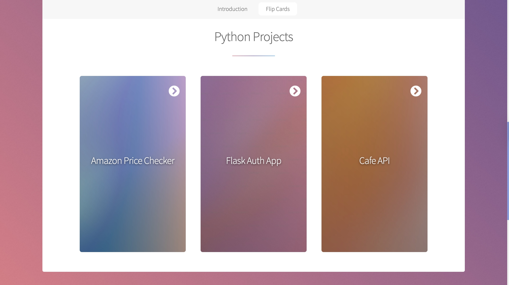

# CSS 3D Clickable Flip-Card Portfolio

A one-page portfolio built on the Stellar (HTML5 UP) template, featuring interactive flip-cards  
that showcase three of my Python projects. Each card flips over to reveal an overview,  
key features, tech stack, and a direct link to the GitHub repo.

## How It Works

- Pure CSS 3D perspective + `<input type="checkbox">` toggle  
- Fully responsive: flex-wrapped grid of cards  
- No JavaScript required for the flip itself

## Demo

## Credits

Stellar by HTML5 UP — html5up.net | @ajlkn  
Demo images courtesy of Unsplash  
Icons by Font Awesome  
Scripts: jQuery, Scrollex, Responsive Tools  

*Free for personal and commercial use under the CC A 3.0 license.*  
